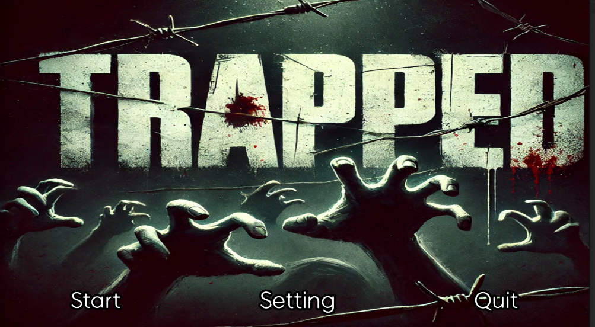
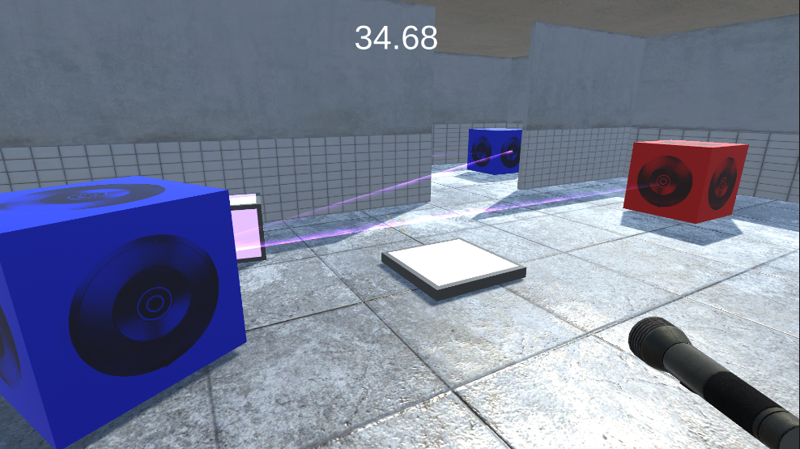
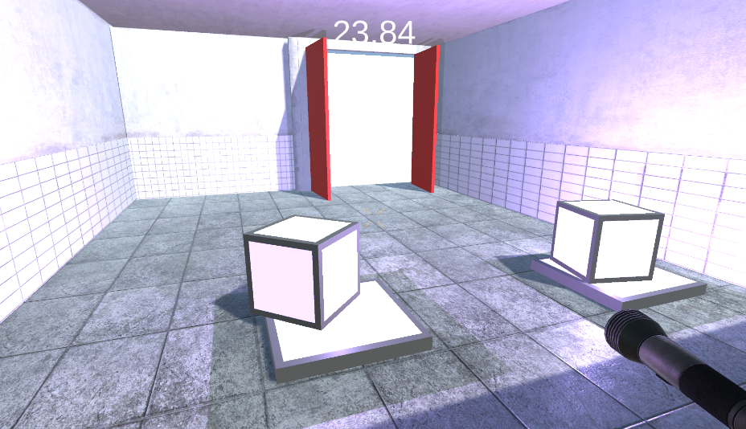

# Puzzle_Horror_8_Team
 
## 🎤 Project
내일배움캠프 Unity 6기 유니티 심화 프로젝트

 ## 👨‍👨‍👦 멤버구성 
 - 팀장 : 임석규
 - 팀원 : 이선욱
 - 팀원 : 이종균
 - 팀원 : 이민섭

## ✏️ 게임 소개
- 게임이름 : Trapped
- 게임컨셉 : <3D 퍼즐게임> + <호러>
- 개발환경 : Unity 2022.3.17f1
- 개발기간 : 24.10.31 ~ 24.11.07

## 🔧 기능 소개
- 레이져 로직 : 

- 발판 로직 : 

## 📎 참고 에셋 출처
- 배경

- https://assetstore.unity.com/packages/3d/environments/hospital-horror-pack-44045
- https://assetstore.unity.com/packages/3d/environments/pbr-hospital-horror-pack-free-80117

  소품

- https://assetstore.unity.com/packages/3d/props/electronics/flashlight-18972
- https://assetstore.unity.com/packages/3d/props/retro-psx-horror-puzzle-item-pack-icon-lowpoly-250188
- https://assetstore.unity.com/packages/3d/props/electronics/keypad-free-262151
- https://assetstore.unity.com/packages/vfx/shaders/low-poly-stair-light-lite-187530
- 

크리쳐

- https://assetstore.unity.com/packages/3d/characters/book-head-monster-287653
- https://assetstore.unity.com/packages/3d/characters/humanoids/skinless-zombie-226029
- https://assetstore.unity.com/packages/3d/characters/creatures/mn-d-253748

사운드

- https://assetstore.unity.com/packages/audio/sound-fx/horror-sfx-082918-127389
- https://assetstore.unity.com/packages/audio/music/free-horror-ambience-2-215651#content